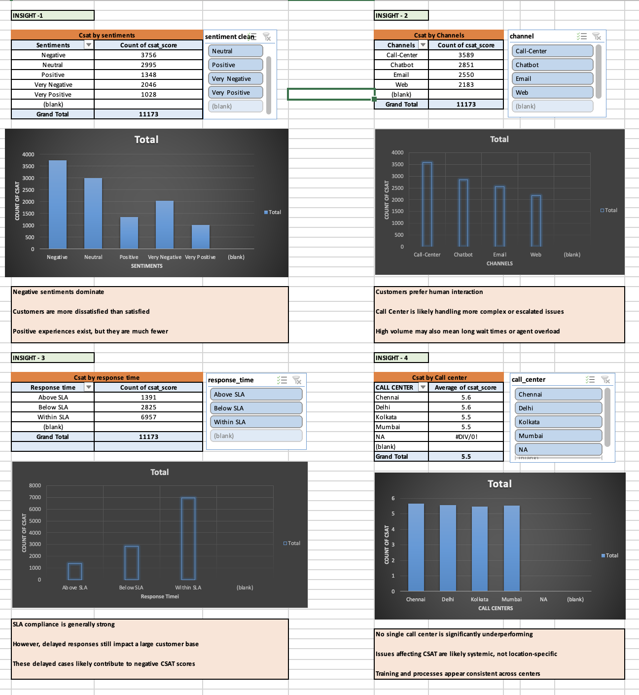
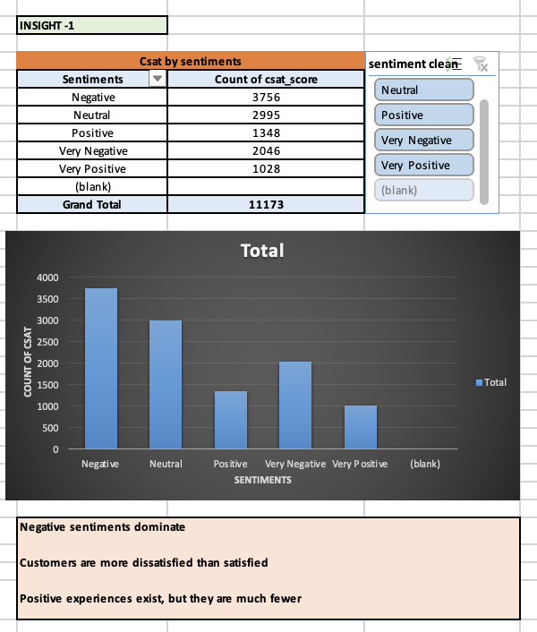
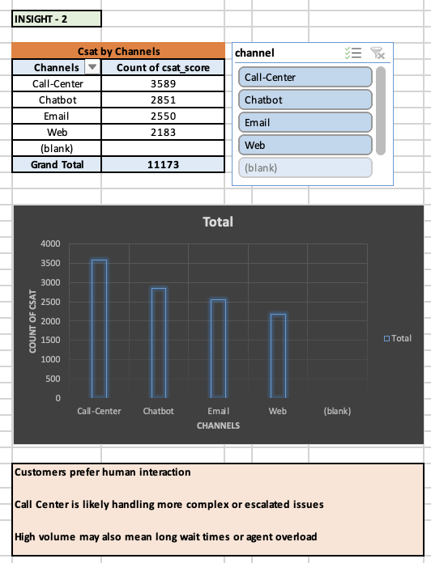
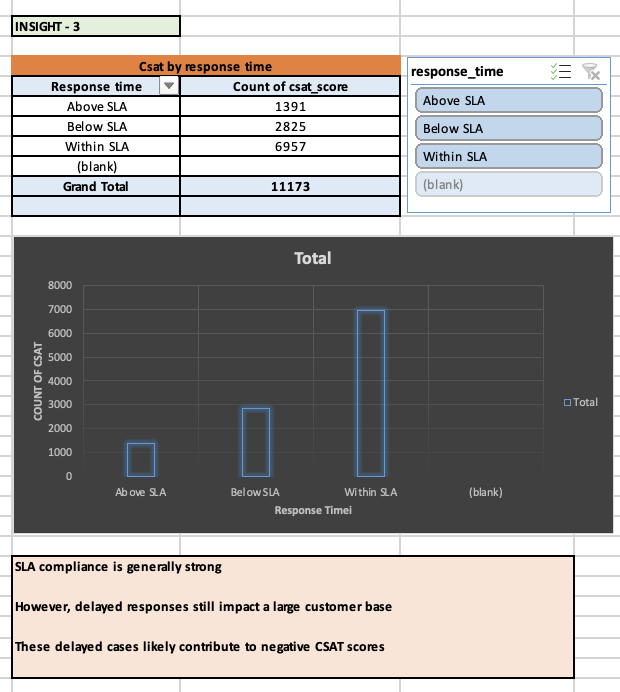
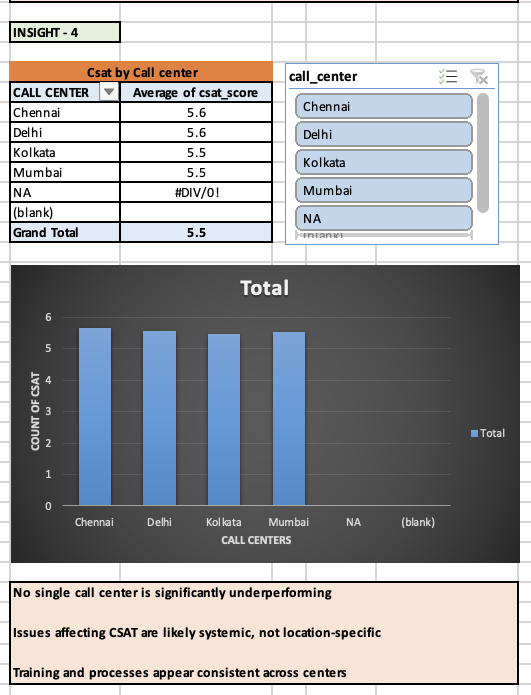

# 📊 Flipkart Customer Service Analysis using Excel

## 📌 Project Overview
This project analyzes Flipkart customer service operations to identify factors affecting customer satisfaction and retention.  
Using Excel dashboards, pivot tables, charts, and slicers, the project uncovers insights related to customer sentiments, response times, service channels, and call center performance.

The goal is to help improve customer experience and retention through data-driven insights.

---

## 🎯 Business Objective
Flipkart observed declining customer retention rates and wanted to understand whether customer service operations were impacting customer satisfaction.

This analysis focuses on:
- Customer sentiments
- Response SLA performance
- Call center effectiveness
- Channel-wise customer interactions
- CSAT trends

---

## 🛠️ Tools & Features Used
- Microsoft Excel
- Pivot Tables
- Pivot Charts
- Slicers
- Dashboard Design
- Data Cleaning
- Descriptive Analysis
- Business Insights & Recommendations

---

## 📂 Dataset Information
The dataset contains customer service interaction data including:
- Customer sentiment
- CSAT score
- Response time
- Channel type
- Call center
- City & State
- Call duration
- Timestamp

---

## 📈 Dashboard Highlights

### 🔹 Sentiment Analysis
- Negative sentiments dominate customer interactions
- Positive experiences are comparatively lower

### 🔹 Channel Analysis
- Call Center handles the highest customer interactions
- Customers prefer human-assisted support channels

### 🔹 Response Time Analysis
- Majority responses are within SLA
- Delayed responses contribute to negative customer sentiment

### 🔹 Call Center Analysis
- Performance across call centers remains relatively consistent
- No major underperforming center identified

---

## 📊 Dashboard Screenshots

### Dashboard Overview


### Sentiment Analysis


### Channel Analysis


### Response Time Analysis


### Call Center Analysis


---

## 💡 Key Insights
- Negative customer sentiment is significantly higher than positive sentiment
- Human interaction channels receive more customer traffic
- SLA delays impact customer satisfaction scores
- Customer support processes appear operationally stable across centers

---

## 🚀 Recommendations
- Reduce delayed response cases to improve customer satisfaction
- Improve customer handling for negative sentiment cases
- Optimize chatbot and digital channels for better engagement
- Focus on proactive customer support strategies

---

## 📁 Project Structure
```text
flipkart-customer-service-analysis-excel/
│
├── dataset/
├── dashboard/
├── presentation/
├── screenshots/
├── README.md
```

---

## 👩‍💻 Author
**Harshita Sharma**  
Data Analyst | SQL | Excel | Tableau | Power BI | Python

- GitHub: https://github.com/harshitasharma1424
- LinkedIn: https://linkedin.com/in/harshitasharma1424
